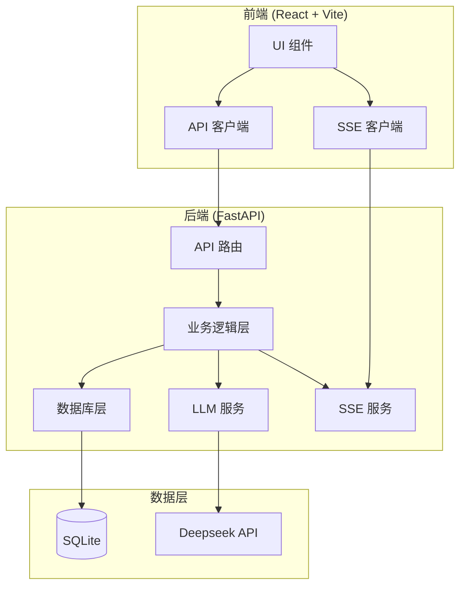

# AI Panel Studio 架构文档

## 系统架构



## 核心模块

### 1. 数据库层 (db.py)

**设计原则**：
- 使用 `BEGIN IMMEDIATE` / `COMMIT` / `ROLLBACK` 显式事务控制
- PRAGMA 配置：`journal_mode=WAL`, `synchronous=NORMAL`, `foreign_keys=ON`
- 复用 agent-roundtable 的 RoundtableDB 模式

**核心方法**：
- `create_discussion()` - 创建讨论
- `add_participant()` - 添加参与者
- `add_speech()` - 记录发言 + 轮次管理
- `calculate_convergence()` - 计算收敛度

### 2. 业务逻辑层 (core.py)

**设计原则**：
- 复用 agent-roundtable 的 RoundtableCore 模式
- 所有方法返回 JSON-serializable dict
- 异步操作支持 SSE 流式推送

**核心方法**：
- `generate_guests()` - AI 生成嘉宾
- `create_discussion()` - 创建讨论
- `record_speech()` - 记录发言
- `run_discussion()` - 自动运行讨论

### 3. LLM 服务 (llm.py)

**设计原则**：
- 异步调用 Deepseek API
- 支持流式响应
- 结构化 Prompt 设计

**核心方法**：
- `generate_guests()` - 生成嘉宾阵容
- `generate_speech()` - 生成发言内容
- `extract_findings()` - 提取共识/分歧
- `generate_summary()` - 生成讨论总结

### 4. SSE 服务 (sse.py)

**设计原则**：
- 参考 agent-roundtable 的 WebPublisher 模式
- 支持多种事件类型
- 异步队列管理

**事件类型**：
- `speech_start` - 发言开始
- `speech_token` - 发言增量（流式）
- `speech_end` - 发言结束
- `finding_update` - 共识/分歧更新
- `round_summary` - 轮次总结
- `status_change` - 状态变更

## 数据流

### 1. 创建讨论流程

```
用户输入话题
    ↓
调用 LLM 生成嘉宾
    ↓
保存嘉宾信息
    ↓
确认阵容
    ↓
状态变为 active
    ↓
进入演播厅
```

### 2. 讨论进行流程

```
主持人开场
    ↓
专家轮流发言
    ↓
SSE 推送发言内容
    ↓
轮次结束
    ↓
提取共识/分歧
    ↓
计算收敛度
    ↓
下一轮或结束
```

### 3. 讨论结束流程

```
达到最大轮次
    ↓
AI 生成总结
    ↓
状态变为 concluded
    ↓
推送结束事件
```

## 关键设计模式

### 1. 事务控制（参考 agent-roundtable）

```python
conn.execute("BEGIN IMMEDIATE")
try:
    # 业务逻辑
    conn.execute("COMMIT")
except:
    conn.execute("ROLLBACK")
    raise
```

### 2. SSE 流式推送

```python
async def event_generator():
    queue = await sse_manager.subscribe(discussion_id)
    while True:
        message = await queue.get()
        yield f"event: {message['event']}\ndata: {json.dumps(message['data'])}\n\n"
```

### 3. 收敛度计算

```python
score = consensus_count / (consensus_count + disagreement_count)
```

## 技术选型

| 组件 | 选择 | 理由 |
|------|------|------|
| 后端框架 | FastAPI | 异步支持好，SSE 原生支持 |
| 前端框架 | React | 组件化开发，生态丰富 |
| 数据库 | SQLite | 轻量级，无需额外服务 |
| 实时通信 | SSE | 简单可靠，浏览器原生支持 |
| LLM | Deepseek V4 Pro | 性价比高，中文支持好 |

## 参考项目

本项目参考了 agent-roundtable 的以下设计：
1. 数据库操作模式（RoundtableDB）
2. 业务逻辑层设计（RoundtableCore）
3. SSE 事件流管理（WebPublisher）
4. 事务控制模式
5. 收敛度计算算法
