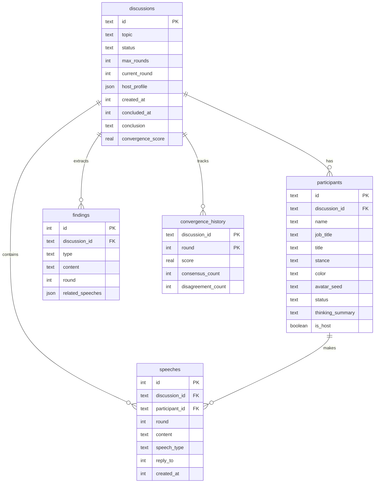

# AI Panel Studio 数据库 Schema

## ER 图

## 表说明

### discussions - 讨论表
| 字段 | 类型 | 说明 |
|------|------|------|
| id | TEXT PK | 讨论唯一标识（nanoid） |
| topic | TEXT | 讨论话题 |
| status | TEXT | 状态：assembling/active/concluded/cancelled |
| max_rounds | INTEGER | 最大轮次 |
| current_round | INTEGER | 当前轮次 |
| host_profile | JSON | 主持人信息 |
| created_at | INTEGER | 创建时间戳 |
| concluded_at | INTEGER | 结束时间戳 |
| conclusion | TEXT | 结论文本 |
| convergence_score | REAL | 最终收敛度 |

### participants - 参与者表（主持人+专家）
| 字段 | 类型 | 说明 |
|------|------|------|
| id | TEXT PK | 参与者唯一标识 |
| discussion_id | TEXT FK | 关联讨论 |
| name | TEXT | 姓名 |
| job_title | TEXT | 职业 |
| title | TEXT | 头衔 |
| stance | TEXT | 立场观点 |
| color | TEXT | 专属颜色（hex） |
| avatar_seed | TEXT | 头像生成种子 |
| status | TEXT | 状态：standby/preparing/speaking |
| thinking_summary | TEXT | 当前关注点摘要 |
| is_host | BOOLEAN | 是否主持人 |

### speeches - 发言表
| 字段 | 类型 | 说明 |
|------|------|------|
| id | INTEGER PK | 自增ID |
| discussion_id | TEXT FK | 关联讨论 |
| participant_id | TEXT FK | 发言者 |
| round | INTEGER | 轮次（0=主持人开场） |
| content | TEXT | 发言内容 |
| speech_type | TEXT | 类型：statement/question/rebuttal/summary |
| reply_to | INTEGER | 回复哪条发言 |
| created_at | INTEGER | 时间戳 |

### findings - 共识分歧表
| 字段 | 类型 | 说明 |
|------|------|------|
| id | INTEGER PK | 自增ID |
| discussion_id | TEXT FK | 关联讨论 |
| type | TEXT | 类型：consensus/disagreement/new_point |
| content | TEXT | 内容 |
| round | INTEGER | 轮次 |
| related_speeches | JSON | 相关发言ID列表 |

### convergence_history - 收敛历史表
| 字段 | 类型 | 说明 |
|------|------|------|
| discussion_id | TEXT PK | 关联讨论 |
| round | INTEGER PK | 轮次 |
| score | REAL | 收敛度（0-1） |
| consensus_count | INTEGER | 共识数量 |
| disagreement_count | INTEGER | 分歧数量 |
